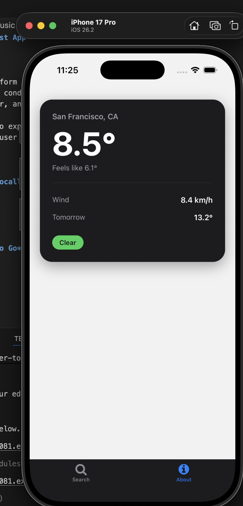

# Weather-Based Music Playlist App

## Project Description

This project is a cross-platform mobile application built with **React Native and Expo** that generates a personalized music playlist based on the current weather conditions. The app retrieves real-time weather data, uses an AI language model to recommend songs that match the mood of the weather, and then searches YouTube to present playable video results to the user.  

The goal of the project is to explore how contextual data (like weather) can be combined with AI-driven recommendations to create a more engaging and human-centered user experience.

---

## Setup Instructions (Run Locally)

### Prerequisites
- Node.js (v18+ recommended)
- npm or yarn
- Expo CLI
- A mobile device with **Expo Go** installed or an emulator

### Installation
```bash
git clone <your-repo-url>
cd <your-project-directory>
npm install
```

### Running the App
```bash
npx expo start
```
Can run on expo go in a physical device by scanning the QR code or press "i" to run on IOS simulator.
#### Only tested on a IOS device

---

## Screenshots




## Learning Journey

### What Inspired This Project
I was interested in exploring how **context-aware applications** can feel more personal and intelligent. Weather is something everyone experiences daily, and I wanted to see how it could be used as a signal to influence music recommendations in a meaningful way. This project also allowed me to combine several technologies I had been learning independently into a single cohesive app.

### Potential Impact
This project demonstrates how AI-powered recommendations can go beyond generic suggestions by incorporating real-world context. While this is a small-scale prototype, the same idea could be expanded into wellness apps, productivity tools, or accessibility-focused applications that adapt dynamically to a user’s environment.

### New Technologies Learned
- **Weather APIs:** Learned how to fetch and interpret real-time environmental data.

---

## Technical Rationale

### Project Structure
The project is structured around separation of concerns:
- **Components** handle UI rendering (weather card, video list, video detail).
- **Navigation** is isolated into tab and stack navigators.
- **Services** encapsulate API logic (weather, AI, YouTube).

This structure makes the codebase easier to reason about, test, and extend.

### Technical Tradeoffs
- **WebView for Video Playback:** Using a WebView is simpler than building a native video player but sacrifices some control over playback behavior.
- **Sequential API Calls:** Song generation and YouTube searches are done sequentially for simplicity, trading off performance for clarity and reliability.
- **Client-Side AI Calls:** Keeps development simple but would need rethinking for production scalability.

### Most Difficult Bug
The most challenging issue was handling asynchronous flows across multiple APIs (weather → AI → YouTube). Debugging involved:
- Logging intermediate outputs at each stage
- Verifying API response shapes
- Ensuring state updates occurred only after all required data was resolved

Breaking the flow into smaller, testable steps made the issue easier to isolate and fix.

---

## AI Usage

### Did You Use AI Tools?
Yes. AI tools (specifically ChatGPT) were used **primarily for UI styling and layout guidance**, as visual design is not my strongest skill.

### Example Prompt and Adaptation
**Prompt Used:**
> “Can you make this React Native component look more polished and modern without changing any functionality?”

**How I Adapted the Output:**
- I selectively applied styling changes while keeping all logic untouched.
- I refactored spacing, colors, and typography to align with the rest of the app.
- I removed suggestions that conflicted with my existing navigation or state structure.

This process treated AI as a **collaborator**, not a source of copy-paste solutions, requiring judgment and refinement to fit the project’s constraints.

---

## Final Notes

This project was an opportunity to practice integrating APIs, AI-assisted development, and mobile UI design into a single application. It reflects both my technical growth and my interest in building context-aware, user-focused software.
